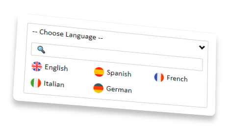

# CustomHtmlSelect
#### Lightweight, simple and modern customizable dropdown selection



#### Features

- 📐 Multiple easy [options](#CustomHtmlSelectOptions) to launch with a search box 🔍
- ⚡ Lightweight, CSS + JS only `4.16KB` and `1.43KB` with GZip
- 🌈 Support to multiple selects in the same page
- 😎 Modern, simple and clean style ✨
- 🖼 Images and icons supported
- 🧪 No code replacing, use the html code

#
#### Usage

You don't need to replace your html selects for another code, just add this and the script will replace all automatically for you.

```html
<link rel="stylesheet" href="/src/chselect.min.css"> <!-- before the </head>-->
<script defer src="/src/chselect.min.js"></script> <!-- before the </body>-->
```

Additionally, you can change the default values adding this simple object:

```js
<script defer src="/src/chselect.min.js"></script>
<script>
var chs = {
	selector: 	'select',
	options: 	'grid search',
	title:		'-- Selecciona uno 😎 --',
	search: 	'&#xf002;'
	}
</script>
```

| Name | Description | Default value |
|----|----|----|
| selector | The html tag, class or id where the script search to convert the selects | select |
| options | The default options to the selects if you dont speficy in the data-chsoptions | list float |
| title | The title is the default text you see before open the select | -- Choose one -- |
| search | The text in the placeholder of search box, you can use emojis, icons or text | 🔍 |

<br>

##### CustomHtmlSelectOptions
You can set the custom options in the ``data-chsoptions=" "``, for example: ``data-chsoptions="grid center search float"``

##### Dropdown style (only use one int the same custom html select)
| Name | Description |
|---|---|
| list | Show the items like a list, if the type display is not defined, list is by default |
| block | Show the items in blocks, don't respect the same space between items  |
| grid | Show the items in grid, this option auto detect the available space to create a most recommendable columns |
| grid-2 | Show the items in grid, with 2 columns |
| grid-3 | Show the items in grid, with 3 columns |
| grid-4 | Show the items in grid, with 4 columns |
| grid-5 | Show the items in grid, with 5 columns |

``Note: You can't combine the dropdown style, only set one.``

<br>

##### More options (you can combine all if you want)
| Name | Description |
|---|---|
| search | Add a search box to filter items |
| float | The item list is superimposed to any other component (like the default select ones) |
| scroll | Add a scroll to the items list, very useful if you have so much items |
| center | Center the items |

<br>

#

<br>

##### Typical errors

If you are using Font Awesome or similar, remember add the font-family, for example, to add a search icon in the placeholder, add this:
```css
.chs .search_box::placeholder {
	font-family:"Font Awesome 5 Free", arial;
	font-style:normal;
	font-weight:900;
}
```
and dont use the html code, use the unicode adding first `&#x` + `f002` = `&#xf002;`
```js
var chs = {
	search: '&#xf002;'
}
```
